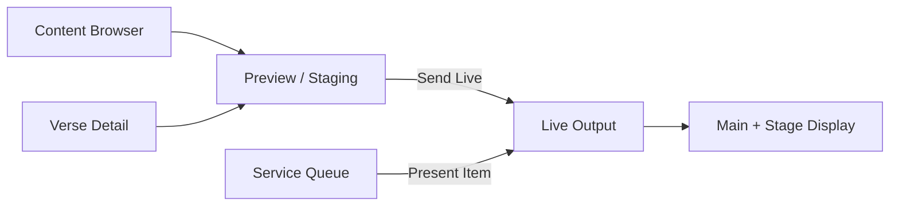

# Presentation Shell Redesign Senior Review

Date: 2026-06-13  
Reviewed: `docs/superpowers/specs/2026-06-13-presentation-shell-redesign.md`, `screenshots/10-with-search.png`, reference concept, current shell/store/output code  
Verdict: direction is correct; amend the spec before implementation so the build behaves like an operator tool, not just a ProPresenter skin.

## Direction

This is not a greenfield UI. It is a reimagining of the current Rhema shell in `screenshots/10-with-search.png`: transcript, preview, live display, queue, search, and detections already exist as product capabilities. The redesign changes priority, layout, and operator workflow.

The concept is the right move. The IA should be:

AI leaving the primary shell is correct for this shipped version. Existing Rhema capabilities are not being deleted; transcript, detections, confidence tooling, song/media/text expansion, and deeper slide editing are deferred from the primary M1 presentation shell and should remain recoverable for later milestones.

## Must Amend Before Build

| Area | Current risk | Required spec amendment |
|---|---|---|
| Responsive shell | The spec targets a dense 3-column control-room UI, but Tauri currently permits `1024x600`; this layout will collapse or clip there. | Define supported operator viewport: preferred `1440x900+`; below `1280px`, collapse Verse Detail under browser or require horizontal-safe layout. Update Tauri min size if this is desktop-only. |
| Queue order | Current `addItem` prepends (`src/stores/queue-store.ts:43-48`), but service queue mental model is append/insert-after-current. | Change queue contract: `addItem` appends by default; add `insertAfterActive` only when explicitly chosen. Preserve active item identity during reorder/remove. |
| Live vs on-air language | `ON AIR`, `GO LIVE`, `SEND LIVE`, `Present Now`, `Black Screen`, and `Clear` can blur broadcast-enabled vs slide-presented state. | Define a state model: Off-air = output black; On-air = live item visible; Send Live/Present Now both set item live and on-air; Black Screen keeps item but hides output; Clear removes item. |
| Staging source of truth | Spec says local `stagedItem`, but browser/detail/queue/live all need predictable sync. | Specify exact rules: selecting browser/detail changes staging only; presenting queue changes live + activeIndex + staging? Decide and encode. My recommendation: queue present also stages the presented item. |
| Keyboard safety | Global `←/→` verse nav can conflict with slide transport expectations and focused custom controls; current spec only excludes input/textarea. | Suppress for `input`, `textarea`, `select`, `[contenteditable]`, dialogs, popovers, and when modifier keys are held. Show a visible selected verse state before arrows do anything. |
| Stage display payload | `broadcast-output.tsx` payload currently only has `{ theme, slide }`; spec adds `nextItem` while also proposing a separate `stage-output.tsx`. | Separate contracts: main output payload remains render-only; stage display payload includes `currentSlide`, `nextItem`, `clockMode`, `theme`. Do not overload the main renderer accidentally. |
| Canvas fit | `CanvasVerse` sizes from width only (`src/components/ui/canvas-verse.tsx:41-49`), so fixed top rows may overflow vertically. | Add a fit mode for preview panels: size by `min(containerWidth/aspect, containerHeight)` and center the canvas. This is required for screenshot fidelity. |
| Logo slate | Spec special-cases `/rhema.svg` outside renderer while also declaring `slide.media` deferred. | Acceptable for M1, but isolate it as `LogoSlateCanvas` or implement minimal `slide.media` support now. Avoid spreading special cases into output/rendering paths. |

## UI/UX Recommendations

| Decision | Recommendation |
|---|---|
| Visual style | Keep the dark, glassy control-room shell. It fits the operator context and makes live output dominant. Use the screenshot as density reference, not exact pixel law. |
| Left queue | Make it the anchor. Use strong current row, visible drag handles, and persistent play affordance. Do not hide critical controls only on hover for live-service use. |
| Top bar | Keep it compact, but make output pills operational: status, click to open/focus window, and connection error state. The red ON AIR button should be unmistakable and not compete with Send Live. |
| Preview vs Live | Maintain strong visual separation: preview uses blue/accent framing; live uses green/red state. Operators must know which screen the congregation sees in under one second. |
| Detail panel | Good idea, but make double-click-to-live visually discoverable and guarded by immediate live-state feedback. Accidental double-click during search is a real service risk. |
| Empty tabs | Fine for M1, but make them quiet. No marketing copy; simple disabled/empty utility states. |
| Icons | Use lucide for controls, but content-kind icons should be filled/colored like the reference for scan speed. |

## Open Questions To Resolve

1. Should queue `Add to Queue` append to the end, insert after current, or preserve the current detected-item prepending behavior? My recommendation: append to end; add explicit "Insert Next" later.
2. When a queue item is sent live, should the staging preview follow it? My recommendation: yes, because it keeps preview/live context aligned after direct queue operations.
3. Is `1024x600` still a supported app size? My recommendation: no for this shell; raise min size or define an alternate compact mode.
4. Does `Black Screen` preserve the current live item for quick restore? My recommendation: yes; `Clear` is the destructive action.

## Build Guidance

Do this in slices:

1. Shell grid + top bar + queue visual grouping.
2. Staging/live panel split with corrected canvas fit.
3. Browser extraction + staged-item state contract.
4. Verse detail + keyboard/double-click behavior.
5. Stage display window and payload contract.
6. Visual QA against the screenshot at desktop and minimum supported viewport.

Validation gates: `bun run typecheck`, `bun run lint`, `bun run test`, `bun run build`, plus rendered Playwright screenshots for the shell, queue selection, staged verse, live output, and stage display.

## Bottom Line

Proceed with this direction. Do not start coding from the current spec verbatim; patch the state/viewport/output contracts above first. The visual concept is senior enough. The build will only survive senior review if the operator semantics are nailed before component work starts.
